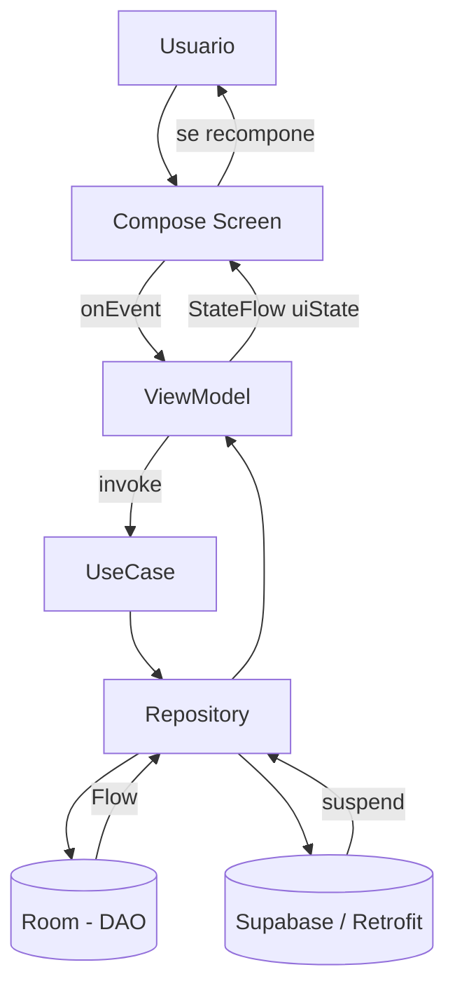
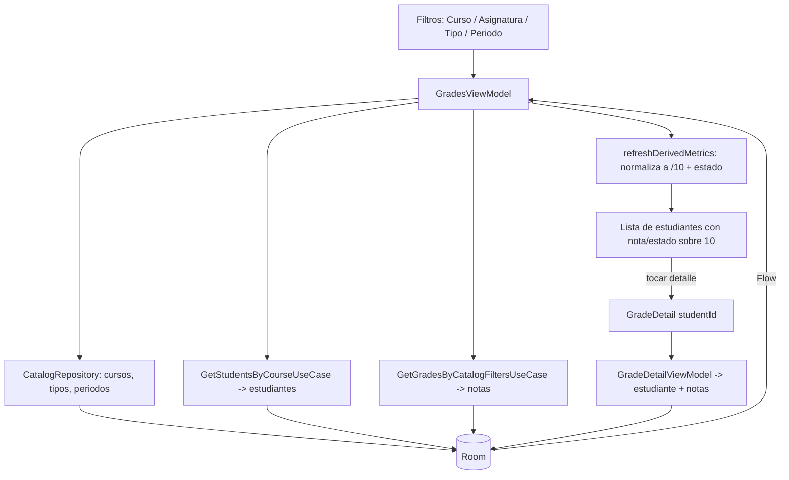

# 📘 Análisis Completo del Proyecto — AlegriApp (versión final)

> Documento de estudio y **verificación** para todo el equipo. Escrito en lenguaje claro, con **nombres reales** de archivos, clases y funciones, para poder **explicar y defender** el código.
>
> **Rama analizada:** `master`.
> **Estado verificado:** los cambios pendientes fueron **mergeados a master** (commit `288e774`, *Merge pull request #28 from irmasaquiza/fix/DetalleCalificaciones*). El proyecto **compila**: `./gradlew :app:compileDebugKotlin` → **BUILD SUCCESSFUL**.
> Donde algo quedó parcial, mock o mejorable, **se dice con honestidad**.

**Paquete base:** `com.example.myapplication` · **App:** `AlegriAPP` · **Backend:** Supabase (PostgREST) + Telegram Bot.

---

## Índice
1. GradeDetailScreen (verificación) · 2. Escala sobre 10 · 3. Materia → Asignatura · 4. Edge-to-Edge · 5. Seeder y runBlocking · 6. Retrofit duplicado · 7. Inyección de dependencias · 8. APIs y Retrofit · 9. Room · 10. Corrutinas · 11. Estados de UI · 12. Navegación · 13. Jetpack Compose · 14. Registro de Calificaciones · 15. Archivos importantes · 16. Verificación de cambios pendientes · 17. Problemas encontrados · 18. Recomendaciones · 19. Guía para defensa oral · 20. Diagramas Mermaid · 21. Conclusión.

---

## 1. GradeDetailScreen

### ¿Cómo funcionaba antes?
Usaba **datos mock**: simulaba la carga con `delay(500)` y buscaba un estudiante inventado con `findMockDetailById(studentId)`. No tocaba Room, ni ViewModel, ni API.
```kotlin
// ANTES (ya NO está en producción)
LaunchedEffect(studentId) {
    uiState = GradeDetailUiState.Loading
    delay(500)
    val mock = findMockDetailById(studentId)
    uiState = if (mock == null) Empty else Success(student = mock)
}
```

### ¿Cómo funciona ahora? (verificado en master)
- ❌ **Ya NO usa `delay(500)`** en el flujo real.
- ❌ **Ya NO usa `findMockDetailById`** en producción. *(Esa función todavía existe en `GradeDetailMockData.kt`, pero solo para los `@Preview`; es código muerto en producción — ver “pendiente menor” abajo.)*
- ✅ **Consume un ViewModel:** `GradeDetailViewModel`.
- ✅ **Se conecta con Room** vía Repository + UseCases.

**Flujo desde la pantalla hasta la fuente de datos:**
```
GradeDetailScreenRoute(studentId)
  → GradeDetailViewModel
      → GetStudentByIdUseCase  → StudentRepository.observeStudentById → StudentDao.observeStudentById  (Room)
      → GetGradesByStudentUseCase → GradeRepository.observeGradesByStudent → GradeDao.observeGradesByStudent (Room)
      → NetworkMonitor.isOnline (banner offline)
      → SyncRepository.syncAll() (botón "Sincronizar ahora")
  → combine(...) → GradeDetailUiState (Loading/Empty/Error/Success)
  → collectAsStateWithLifecycle() → GradeDetailContent dibuja
```

- **Cómo obtiene el estudiante seleccionado:** por navegación tipada. En `AppNavGraph` se recupera con `backStackEntry.toRoute<GradeDetail>().studentId` y se pasa a `GradeDetailScreenRoute`.
- **Cómo obtiene sus calificaciones:** `GradeDao.observeGradesByStudent(studentId)` (Flow desde Room).
- **DAO/Repository/UseCase que intervienen:** `StudentDao`/`GradeDao` → `StudentRepositoryImpl`/`GradeRepositoryImpl` → `GetStudentByIdUseCase`/`GetGradesByStudentUseCase`.

### Construcción del detalle (real)
```kotlin
combine(getStudentByIdUseCase(id), getGradesByStudentUseCase(id), onlineFlow) { student, grades, online ->
    when {
        student == null -> GradeDetailUiState.Error("No se encontró el estudiante…")
        grades.isEmpty() -> GradeDetailUiState.Empty
        else -> GradeDetailUiState.Success(buildDetailStudent(student, grades), grades, isFromCache = !online)
    }
}
```
`buildDetailStudent` agrupa por asignatura y calcula promedios **sobre 10** con `GradeScale.normalize(...)`.

### Archivos modificados / creados
- **Creados:** `presentation/grades/GradeDetailViewModel.kt`, `domain/usecase/grade/GetGradesByStudentUseCase.kt`, `domain/usecase/student/GetStudentByIdUseCase.kt`.
- **Modificados:** `presentation/grades/GradeDetailScreen.kt` (Route + contenido sin mock), `data/local/dao/StudentDao.kt` (`observeStudentById`), `domain/repository/StudentRepository.kt` + `data/repository/StudentRepositoryImpl.kt`, `domain/repository/GradeRepository.kt` + `data/repository/GradeRepositoryImpl.kt`, `core/navigation/AppNavGraph.kt` (usa `GradeDetailScreenRoute`), `core/di/AppModule.kt` (providers nuevos).

### ¿Quedó completo o parcial? → **Completo en datos, parcial en detalles secundarios**
- ✅ Estudiante y calificaciones: **datos reales** de Room.
- ⚠ **Sin fecha por nota** en el esquema → la “fecha” de cada actividad muestra el **tipo de evaluación** (`grade.activityType`).
- ⚠ **“Última sincronización”** se muestra como `—` (el modelo de dominio `Grade` no expone los timestamps de sync).
- ⚠ **“Exportar PDF”** sigue siendo **prototipo** (solo muestra un snackbar).
- ⚠ El detalle muestra **todas** las notas del estudiante (no filtra por el catálogo elegido en `GradesScreen`).
- ⚠ Con datos **demo** del seeder, la asignatura es `"General"` (una sola materia) hasta que entren datos reales de Supabase.

---

## 2. Escala de calificaciones sobre 10

### ¿Dónde estaba la escala sobre 20?
Estaba **quemada y dispersa**: defaults `20.0` en `GradeEditDraft`/`GradesEvent`, umbral de aprobación `score < 10.0` (50% de 20), texto `"/ 20"` en `GradeDetailHeaderCard`, seeder con `maxScore = 20.0` y mocks con `maxScore = 20`.

### ¿Qué se cambió para trabajar sobre 10? (verificado)
Se creó una **fuente única de verdad** en `core/common/Constants.kt`:
```kotlin
object GradeScale {
    const val MAX_SCORE: Double = 10.0      // escala oficial
    const val MAX_SCORE_INT: Int = 10       // para mostrar "8 / 10"
    const val PASSING_GRADE: Double = 7.0   // nota mínima para aprobar
    fun normalize(score: Double, maxScore: Double) =
        if (maxScore > 0.0) score / maxScore * MAX_SCORE else score
}
```

| Capa | ¿Sobre 10? | Evidencia |
| --- | --- | --- |
| UI (`GradeDetailHeaderCard`) | ✅ | `text = "/ ${GradeScale.MAX_SCORE_INT}"` |
| UI (filtros/cards) | ✅ | muestran `maxScore` del dato (ahora 10) |
| ViewModel (`GradesViewModel`) | ✅ | `GradeScale.normalize(...)`, `< GradeScale.PASSING_GRADE` |
| ViewModel (`GradeDetailViewModel`) | ✅ | normaliza score/promedios, `MAX_SCORE_INT`, `PASSING_GRADE` |
| Defaults (`GradeEditDraft`, `GradesEvent`) | ✅ | `= GradeScale.MAX_SCORE` |
| Seeder (`DatabaseSeeder`) | ✅ | notas demo `8.0`/`9.0`, `maxScore = GradeScale.MAX_SCORE` |
| Mocks de preview | ✅ | reescalados a /10 |
| Telegram (`TelegramMessageBuilder`) | ✅ | fallback `?: GradeScale.MAX_SCORE` |

- **¿El promedio se calcula sobre 10?** ✅ Sí. `GradesViewModel.refreshDerivedMetrics` y `GradeDetailViewModel.buildDetailStudent/buildSubject` promedian la nota **normalizada** a 10.
- **¿“Aprobado” se calcula sobre 10?** ✅ Sí: `score < GradeScale.PASSING_GRADE (7.0)` → en riesgo; si no, aprobado.

### Capas de datos: Entidad/DTO/Mapper
- `GradeEntity.maxScore` (`nota_maxima`, Double) y `CalificacionRemoteDto.notaMaxima` (`nota_maxima`, Double) **no fuerzan** una escala: guardan el `maxScore` que venga. La app **normaliza** al mostrar, así que aunque un registro venga sobre 20, se ve sobre 10. **No fue necesaria** migración de Room.

### ¿Queda algún valor hardcodeado sobre 20?
- En el módulo de notas **no** queda `/20` activo. Solo aparece la palabra “20” en un **comentario** de `GradeEditDraft.kt` (“antes 20.0”). El resto usa `GradeScale`.

---

## 3. Cambio de “Materia” a “Asignatura”

### ¿Dónde estaba?
Hardcodeado en `presentation/grades/components/GradeFilterSection.kt` (`label = "Materia"`).

### ¿Cómo quedó? (verificado)
- ✅ Movido a **string resources** en `app/src/main/res/values/strings.xml`:
  ```xml
  <string name="grade_filter_subject">Asignatura</string>
  ```
- ✅ Usado con `stringResource(R.string.grade_filter_subject)` en `GradeFilterSection`.

### ¿Todavía existe “Materia” en alguna parte visible?
- ⚠ **Sí, en el módulo de Asistencias** (no en Calificaciones): `AttendanceScreen.kt:182` (`label = "Materia"`) y `AttendanceViewModel.kt:293` (etiqueta por defecto `?: "Materia"`). Quedó **fuera del alcance** del pedido (era el filtro de Calificaciones), pero se documenta. Para unificar, basta reusar `R.string.grade_filter_subject` ahí.

---

## 4. Edge-to-Edge

### ¿Dónde se agregó? (verificado)
En `MainActivity.onCreate`, antes de `setContent`:
```kotlin
import androidx.activity.enableEdgeToEdge   // línea 9
...
override fun onCreate(savedInstanceState: Bundle?) {
    super.onCreate(savedInstanceState)
    enableEdgeToEdge()                       // línea 31
    SyncNotifications.ensureChannel(applicationContext)
    ...
}
```

### ¿Cómo se manejan los insets?
Cada pantalla usa `Scaffold { innerPadding -> ... Modifier.padding(innerPadding) }`. El `Scaffold` consume los insets de status/navigation bar y entrega `innerPadding`; el contenido se desplaza con ese padding y **no queda tapado** por las barras del sistema.

### ¿Qué pantallas dependen?
Todas las que usan `Scaffold`: Login, Home, Asistencias, **Calificaciones**, **Detalle de calificaciones**, Incidentes.

### ¿Completo o parcial? → **Completo.** `enableEdgeToEdge()` está aplicado y los insets se respetan vía Scaffold.

---

## 5. Seeder y runBlocking

### ¿Dónde estaba el problema?
En `AppModule.provideDatabase`, al construir la BD se sembraba con `runBlocking(Dispatchers.IO) { DatabaseSeeder.seedIfEmpty(...) }`, lo que **bloqueaba el hilo llamante** (posiblemente el principal) durante la siembra.

### ¿Qué cambio se hizo? (verificado)
```kotlin
private val appScope = CoroutineScope(SupervisorJob() + Dispatchers.IO)   // línea 76
...
.also { database ->
    db = database
    appScope.launch { DatabaseSeeder.seedIfEmpty(database) }              // línea 125 (no bloquea)
}
```
- ✅ **Ya no existe `runBlocking`** (solo se menciona en un comentario explicativo).
- ✅ La siembra corre en `appScope` con `Dispatchers.IO`.

### ¿Por qué es mejor?
No congela el hilo que crea la base. Como las pantallas leen por `Flow`, se actualizan solas cuando la siembra termina.

### ¿Sigue funcionando el seeder / se inicializa la base?
✅ Sí. `seedIfEmpty` solo inserta si las tablas están vacías. **Riesgo residual menor:** la siembra es asíncrona, así que al primer arranque puede haber un instante con tablas vacías antes de que el `Flow` re-emita con los datos demo (aceptable y esperado).

---

## 6. Dependencias Retrofit duplicadas

### ¿Había duplicados?
Sí: `retrofit.core` y `retrofit.gson` estaban declaradas **dos veces** en `app/build.gradle.kts`.

### ¿Cómo quedó? (verificado, líneas 94–97)
```kotlin
implementation(libs.retrofit.core)    // cliente HTTP tipado (Retrofit)
implementation(libs.retrofit.gson)    // convierte JSON ↔ objetos (Gson)
implementation(libs.okhttp.core)      // cliente HTTP base (OkHttp)
implementation(libs.okhttp.logging)   // interceptor de logs de red
```
- ✅ Sin duplicados de Retrofit. ✅ El proyecto **compila**.
- **Otras dependencias importantes:** Compose/Material3 (UI), Room + KSP (BD), Navigation Compose (navegación), Kotlinx Serialization (rutas tipadas), Coroutines (asíncrono), WorkManager (sync), DataStore (sesión/prefs), ML Kit Text Recognition (OCR), CameraX (declarada en el catálogo).
- **Nota:** las versiones están centralizadas en `gradle/libs.versions.toml`. No se detectaron otros duplicados problemáticos.

---

## 7. Inyección de dependencias

### ¿Se mantiene `AppModule`? → ✅ Sí (DI **manual**, no Hilt).
Archivo: `core/di/AppModule.kt` (un `object` Singleton).

### ¿Qué objetos crea y cómo se instancian?
- **Singletons compartidos** (con `@Volatile` + `synchronized`): `AppDatabase` (Room), `NetworkMonitor`, `SupabaseApiService` (Retrofit), `SyncScheduler`, `AuthPreferences`, `SyncPreferences`, `CatalogRepository`, `AuthRepository`, `TeacherDataSyncer`, cliente OkHttp de Telegram.
- **Room/DAOs:** `provideDatabase(context)` crea la BD; los DAOs salen de `database.studentDao()`, `gradeDao()`, etc.
- **Retrofit:** `RetrofitClient.createSupabaseApi(url, key)` y `provideTelegramApiService()`.
- **Repositories:** `provideGradeRepository`, `provideStudentRepository`, `provideSyncRepository`, …
- **UseCases:** `provideSaveGradeUseCase`, `provideGetGradesByCatalogFiltersUseCase`, **`provideGetGradesByStudentUseCase`**, **`provideGetStudentByIdUseCase`**, …
- **ViewModels:** se crean en cada pantalla con `viewModelFactory { initializer { ... AppModule.provideX(context) ... } }`.

### ¿Se migró a Hilt? → **No**, y tiene sentido mantener DI manual:
- Proyecto académico ya funcional; migrar implica plugin + anotar ~10 repos, ~20 use cases y reescribir todas las factories. Cambio **transversal de alto riesgo** sin beneficio funcional inmediato.
- `AppModule` ya centraliza todo; agregar dependencias nuevas es trivial.

### Ventajas / desventajas
- **Ventajas:** simple, sin generación de código, fácil de leer/depurar, sin dependencias extra.
- **Desventajas:** más *boilerplate* manual, scopes a mano, menos cómodo para tests con mocks que un framework DI.

---

## 8. APIs y Retrofit

### Dónde están
`data/remote/api/`: **`SupabaseApiService`** (REST de Supabase / PostgREST) y **`TelegramApiService`** (+ `TelegramApiFactory`, `TelegramConfig`).

### Cliente HTTP / Base URL / Interceptor
`core/network/RetrofitClient.kt`:
- **Interceptor OkHttp** agrega headers `apikey`, `Authorization: Bearer`, `Content-Type`, `Accept` a cada llamada Supabase.
- **Base URL** y claves desde `local.properties` → `BuildConfig` (`SUPABASE_URL`, `SUPABASE_KEY`, `TELEGRAM_BOT_TOKEN`).
- Si faltan credenciales, `createSupabaseApi` devuelve `null` → la app sigue **offline**.
- Conversión JSON con **Gson** (`GsonConverterFactory`).

### Endpoints (métodos HTTP usados)
Se usan **GET** (PULL) y **POST** (upsert). **No** hay PUT/DELETE: las actualizaciones se hacen con POST + header `Prefer: resolution=merge-duplicates` (upsert por `uuid`) y el borrado es **lógico** (`is_deleted`).
| Tabla | Método | Función |
| --- | --- | --- |
| `usuarios` | GET | `getUsuariosByEmail` (login) |
| `cursos` | GET | `getCursosActivos` / `…ByIds` |
| `materias` | GET | `getMateriasActivas` |
| `tipos_evaluacion` | GET | `getTiposEvaluacionActivos` |
| `periodos_academicos` | GET | `getPeriodosActivos` |
| `tipos_incidente` | GET | `getTiposIncidenteActivos` |
| `estudiantes` | GET | `getEstudiantesActivos` / `…UpdatedSince` |
| `estudiante_curso` | GET | `getEstudianteCursosActivos` (matrículas) |
| `docente_curso` | GET | `getDocenteCursosActivos` |
| `asistencias` | POST | `upsertAsistencia` |
| `calificaciones` | POST | `upsertCalificacion` |
| `incidentes` | GET/POST | `getIncidentes` / `upsertIncidente` |

### DTOs y Mappers
- **DTOs** en `data/remote/dto/`: `UsuarioRemoteDto`, `EstudianteRemoteDto`, `AsistenciaRemoteDto` (+ `AsistenciaInsertDto`/`ResponseDto`), `CalificacionRemoteDto` (`nota_obtenida`, `nota_maxima`, …), `IncidenteRemoteDto`, `CatalogRemoteDtos`, `TelegramMessageRequest`, `TelegramResponse`.
- **Mappers** en `data/mapper/`: `RemoteMapper`, `StudentRemoteMapper`, `GradeMapper`, `AttendanceMapper`, `IncidentMapper`, `CatalogMapper` (DTO ↔ Entity ↔ Dominio).

### Repos que usan API
`SyncRepositoryImpl` (sync general), `CatalogRepositoryImpl`, `AuthRepositoryImpl`, `TeacherDataSyncer`, `TelegramRepositoryImpl`.

### Manejo de errores y éxitos
- Llamadas envueltas en `runCatching { ... }.getOrElse { SyncOutcome.Failure(...) }`.
- Traducción de errores en `SyncRepositoryImpl.formatSyncError` (RLS `42501`, FK `23503`, duplicado `409`, columna inexistente `42703`).
- Sin red → `SyncOutcome.Skipped(...)`. Éxito → `SyncOutcome.Success(...)`.

### Qué viene del backend / qué se guarda / qué solo se muestra
- **Del backend (PULL):** usuarios, catálogos, estudiantes, matrículas, incidentes.
- **Se guarda en Room:** catálogos, estudiantes, incidentes (cache); y asistencias/notas locales que luego se suben (PUSH).
- **Solo se muestra:** lo que la UI lee de Room (la pantalla nunca consume la API directamente).

---

## 9. Room

### Clase principal y versión
`data/local/AppDatabase.kt` → `abstract class AppDatabase : RoomDatabase()`, **versión 10**, `exportSchema = false`. Expone 5 DAOs.

### Entidades y tablas (13)
`StudentEntity`→`students` · `AttendanceEntity`→`asistencias` · `GradeEntity`→`calificaciones` · `IncidentEntity`→`incidentes` · `CursoCatalogEntity`→`catalog_cursos` · `MateriaCatalogEntity`→`catalog_materias` · `TipoEvaluacionCatalogEntity`→`catalog_tipos_evaluacion` · `PeriodoAcademicoCatalogEntity`→`catalog_periodos` · `TipoIncidenteCatalogEntity`→`catalog_tipos_incidente` · `StudentCourseEntity`→`student_courses` · `TeacherCourseEntity`→`teacher_courses` · `StudentRepresentativeEntity`→`student_representatives` · `TelegramConfigEntity`→`telegram_configs`.

Las tablas “móviles” traen columnas **offline-first**: `uuid` (único), `remote_id`, `sync_status`, `sync_error`, `last_sync_attempt`, `server_updated_at`, `is_deleted` (borrado lógico).

### DAOs — métodos principales
- **`GradeDao`**: `observeGradesByStudent`, `observeGradesByCatalogFilters`, `observeGradesBySubjectAndPeriod`, `getByStudentCatalogAndDescription`, `insertOrReplaceGrade(s)`, cola sync (`getPendingSync`, `markAsSending/Synced/Failed`), `countGrades`, `observePendingCount`.
- **`StudentDao`**: `observeStudents`, `observeStudentsByCourse`, `observeStudentsForTeacher`, `getStudentById`, **`observeStudentById`** (nuevo, para el detalle), `insertOrReplaceStudents`, cola sync, `countStudents`.
- **`AttendanceDao`**: `observeAttendanceByDate`, `observeAttendanceByDateCourseSubject`, `insertOrReplaceAttendance(List)`, cola sync, `observePendingCount`.
- **`IncidentDao`**: lectura/escritura + colas PUSH y Telegram (`getPendingPushToSupabase`, `markPush…`).
- **`CatalogDao`**: `observeCursos`, `observeMateriasByCourse`, `observeTiposEvaluacion`, `observePeriodos`, `observeTiposIncidente`, `replace…` de catálogos y relaciones, `getPrincipalRepresentanteId`, `getTelegramConfigForRepresentante`, `countCursos`.

### Relaciones lógicas
No hay `@ForeignKey`, pero existen relaciones por id resueltas con `INNER JOIN`: `students` ↔ `student_courses` ↔ `catalog_cursos`; `teacher_courses` (docente↔curso); `students` ↔ `student_representatives` ↔ `telegram_configs`.

### Qué se guarda / consulta / actualiza
- **Guarda:** notas, asistencias, incidentes, catálogos, estudiantes, config Telegram.
- **Consulta:** todo lo de pantalla, vía `Flow`.
- **Actualiza:** estados de sync (`markAsSynced/Failed`), borrado lógico (`softDelete`).

### Conexión Room → Repository → ViewModel
DAO (`Flow`) → Repository mapea Entity→Dominio (`.map { it.toDomain() }`) → ViewModel colecta y arma el `StateFlow` de la pantalla.

---

## 10. Corrutinas

- **`viewModelScope.launch`:** en todos los ViewModels (`GradesViewModel.saveGrades`, `GradeDetailViewModel.init`, `LoginViewModel.submit`, …).
- **`suspend`:** use cases (`SaveGradeUseCase.invoke`), repos (`syncAll`, `syncPendingRecords`, `upsertGrade`), DAOs de escritura, OCR (`processImage`).
- **`Flow`:** lecturas Room reactivas + `NetworkMonitor.isOnline` (`callbackFlow`).
- **`StateFlow`:** estado de cada pantalla, expuesto inmutable con `asStateFlow()`.
- **`Dispatchers.IO`:** sincronización (`viewModelScope.launch(Dispatchers.IO) { syncRepository.syncAll() }`) y siembra (`appScope`).
- **Segundo plano:** sync PULL/PUSH, siembra de BD, envío Telegram (vía `SyncWorker` + WorkManager).
- **Loading/Success/Error:** banderas en los `UiState` o estados de las sealed classes (`GradeDetailUiState.Loading/Error/...`).
- **Seeder:** se eliminó `runBlocking`; ahora `appScope.launch` (sección 5). **No queda LiveData** en el proyecto (todo es StateFlow/Flow).

Ejemplo (combinar flujos en el detalle):
```kotlin
combine(getStudentByIdUseCase(id), getGradesByStudentUseCase(id), onlineFlow) { s, g, online -> ... }
    .collect { _uiState.value = it }
```

---

## 11. Estados de UI

Se usan **dos enfoques** complementarios:

### a) `data class` de estado + banderas
`LoginUiState`, `AttendanceUiState`, `GradesUiState`, `IncidentUiState` (datos + `isLoading`, `isSaving`, `isSending`, `isProcessingOcr`, `errorMessage`, `successMessage`, `isOffline`, filtros). Se actualizan inmutables: `_uiState.update { it.copy(...) }`.

### b) `sealed class` / `sealed interface` (exhaustivo)
- `GradeDetailUiState`: `Loading`, `Empty`, `Offline`, `Error(message)`, `Success(student, grades, isFromCache)`.
- `ResultState<T>` (login): `Loading`, `Success`, `Error`.
- `SyncState`: `Idle`, `Sending`, `Success`, `Error` (estado de **sincronización** por registro).
- `SyncOutcome`: `Success`, `Skipped`, `Failure` (resultado de una pasada de sync).

La UI decide con `when(state)` y observa con `collectAsStateWithLifecycle()`. Estados efímeros locales: `remember`/`rememberSaveable` (expandir tarjeta, `SnackbarHostState`).

---

## 12. Navegación

- **Rutas:** `core/navigation/AppRoutes.kt` — **tipadas** con `@Serializable`:
  ```kotlin
  @Serializable data object Login : AppRoute
  @Serializable data object Grades : AppRoute
  @Serializable data class GradeDetail(val studentId: Long) : AppRoute
  ```
- **Grafo:** `core/navigation/AppNavGraph.kt` con `NavHost` + `composable<T> { ... }`. Destino inicial según sesión (`authRepository.observeSession()`).
- **Navegar a `GradeDetailScreen`:**
  ```kotlin
  composable<Grades> {
      GradesScreenRoute(onOpenDetail = { studentId, _, _ -> navController.navigate(GradeDetail(studentId)) })
  }
  composable<GradeDetail> { entry ->
      val route = entry.toRoute<GradeDetail>()              // recupera argumento tipado
      GradeDetailScreenRoute(studentId = route.studentId, onBack = { navController.popBackStack() })
  }
  ```
- **Parámetro:** `studentId: Long`, pasado de forma **tipada y segura** (sin strings).
- **Ventajas de rutas tipadas:** seguridad en compilación, sin errores de tipeo, argumentos con su tipo real, refactor seguro.

---

## 13. Jetpack Compose

- **Pantallas:** `LoginScreen`, `HomeScreen`, `AttendanceScreen`, `GradesScreen`, `GradeDetailScreen`, `IncidentScreen` (cada una con `…ScreenRoute` que crea el ViewModel).
- **Componentes reutilizables:** `AppScaffold`, `PrimaryActionButton`, `StudentCard`, `LoadingContent`, `ErrorContent`, `OfflineBanner`, `CatalogDropdown`, y de notas: `GradeFilterSection`, `GradeStudentCard`, `GradeSummaryCard`, `GradeDetailHeaderCard`, `GradeDetailSubjectCard`, `GradeStatusChip`.
- **Cards / filtros / listas / formularios:** `Card`; `CatalogDropdown`; `LazyColumn`/`LazyRow` con `items(..., key = { it.id })`; `OutlinedTextField` + `AlertDialog` (`GradeEditDialog`).
- **Scaffold / insets / Material 3:** `Scaffold` con `innerPadding`; tema `MyApplicationTheme` (Material 3 + dynamic color/Material You).
- **Eventos de usuario:** la UI envía eventos al ViewModel (`viewModel.onEvent(GradesEvent.X)`); el ViewModel actualiza el `StateFlow`; la UI **se recompone** al observar `uiState` con `collectAsStateWithLifecycle()`.

---

## 14. Registro de Calificaciones (módulo profundo)

### Archivos involucrados
| Rol | Archivo |
| --- | --- |
| Pantalla | `presentation/grades/GradesScreen.kt` (`GradesScreenRoute` + `GradesScreen`) |
| ViewModel | `presentation/grades/GradesViewModel.kt` |
| Estado / Eventos | `GradesUiState.kt` / `GradesEvent.kt` |
| Filtros | `components/GradeFilterSection.kt` |
| Card estudiante | `components/GradeStudentCard.kt` |
| Edición | `GradeEditDraft.kt` + `GradeEditDialog` (en `GradesScreen.kt`) |
| Escala | `core/common/Constants.kt` (`GradeScale`) |
| UseCases | `GetStudentsByCourseUseCase`, `GetGradesByCatalogFiltersUseCase`, `SaveGradeUseCase` |
| Repos / DAO | `GradeRepositoryImpl`, `CatalogRepositoryImpl`, `StudentRepositoryImpl`, `SyncRepositoryImpl` · `GradeDao`, `CatalogDao`, `StudentDao` |

### Filtros (de dónde salen)
- **Curso:** `catalogRepository.observeCourses()` (`catalog_cursos`).
- **Asignatura:** `catalogRepository.observeSubjectsByCourse(courseId)` (`catalog_materias`). *(label “Asignatura”)*
- **Tipo de evaluación:** `catalogRepository.observeEvaluationTypes()` (`catalog_tipos_evaluacion`).
- **Periodo académico:** `catalogRepository.observeAcademicPeriods()` (`catalog_periodos`).
Los catálogos se sincronizan primero (`syncCatalogsFromRemote()`), se guardan en Room y la UI los lee desde ahí.

### Listado de estudiantes
`GetStudentsByCourseUseCase(courseId)` → `StudentDao.observeStudentsByCourse`.

### Calificaciones
`GetGradesByCatalogFiltersUseCase(courseId, subjectId, evalTypeId, periodId)` → `GradeDao.observeGradesByCatalogFilters`.

### Promedio de sección y cantidad de estudiantes
En `GradesViewModel.refreshDerivedMetrics`, sobre nota **normalizada a 10**:
```kotlin
val gradesByStudent = gradeStore.groupBy { it.studentId }
    .mapValues { (_, v) -> v.map { GradeScale.normalize(it.score, it.maxScore) }.average()... }
classAverage = gradesByStudent.values.average()    // promedio de sección (sobre 10)
```
`GradesUiState.totalStudents = students.size`, `atRiskStudents = riskCount`, `pendingBulletins` = sin nota.

### Estado aprobado/reprobado (sobre 10)
```kotlin
status = when {
    score == null -> NOT_REGISTERED
    score < GradeScale.PASSING_GRADE -> AT_RISK   // < 7
    else -> APPROVED                              // ≥ 7
}
```

### Edición de calificación
`GradeEditDialog` (label “Nota (0–10)”) → evento `GradesEvent.EditGrade` → `applyPendingEdit` (borrador `GradeEditDraft`, `maxScore = GradeScale.MAX_SCORE`). Al **Guardar** → `SaveGradeUseCase` → `GradeRepositoryImpl.upsertGrade` → `GradeDao.insertOrReplaceGrade` (queda `sync_status=IDLE`) → `syncRepository.syncPendingRecords()` (PUSH).

### Navegación al detalle
Card → `onOpenDetail(studentId)` → `navController.navigate(GradeDetail(studentId))` → `GradeDetailScreenRoute`.

### Cambios aplicados aquí
- Escala **20 → 10** (constante `GradeScale`, normalización, umbral 7).
- “Materia” → **“Asignatura”** (string resource).

---

## 15. Archivos importantes

| Archivo | Función | Qué debe saber el equipo |
| --- | --- | --- |
| `MainActivity.kt` | Entrada Android | Llama `enableEdgeToEdge()` + `setContent { AlegriApp() }` |
| `AlegriApp.kt` | Raíz Compose | Tema + navegación + arranca sync por red |
| `core/di/AppModule.kt` | DI manual (Singletons) | Crea BD, repos, APIs, use cases; `appScope` para seed |
| `core/common/Constants.kt` | `GradeScale` | **Escala de notas sobre 10** centralizada |
| `core/navigation/AppRoutes.kt` | Rutas `@Serializable` | Define destinos y argumentos tipados |
| `core/navigation/AppNavGraph.kt` | Grafo | Conecta pantallas; recupera `studentId` con `toRoute` |
| `core/network/RetrofitClient.kt` | Retrofit/OkHttp | Interceptor, base URL, headers |
| `core/sync/SyncWorker.kt` + `SyncScheduler.kt` | Sync background | WorkManager, reintentos, periódico 15 min |
| `data/local/AppDatabase.kt` | Room | 13 entidades, versión 10, 5 DAOs |
| `data/local/DatabaseSeeder.kt` | Siembra demo | Notas sobre 10; corre en `appScope` (sin `runBlocking`) |
| `data/local/dao/GradeDao.kt` | DAO notas | `observeGradesByStudent`, filtros, colas sync |
| `data/local/dao/StudentDao.kt` | DAO estudiantes | Incluye `observeStudentById` (detalle) |
| `data/local/dao/CatalogDao.kt` | DAO catálogos | Cursos/materias/tipos/periodos + relaciones |
| `data/local/entity/GradeEntity.kt` | Entidad nota | `nota_obtenida`, `nota_maxima`, sync cols |
| `data/remote/api/SupabaseApiService.kt` | API REST | Endpoints GET/POST (upsert) |
| `data/remote/dto/CalificacionRemoteDto.kt` | DTO nota | `nota_obtenida`, `nota_maxima` |
| `data/repository/GradeRepositoryImpl.kt` | Repo notas | Une Room ↔ dominio |
| `data/repository/SyncRepositoryImpl.kt` | Sync | PUSH/PULL + manejo de errores |
| `domain/usecase/grade/GetGradesByStudentUseCase.kt` | UseCase (nuevo) | Notas del estudiante (detalle) |
| `domain/usecase/student/GetStudentByIdUseCase.kt` | UseCase (nuevo) | Estudiante reactivo (detalle) |
| `presentation/grades/GradesScreen.kt` | Pantalla notas | Filtros, lista, edición |
| `presentation/grades/GradesViewModel.kt` | Lógica notas | Promedio/estado **sobre 10** |
| `presentation/grades/GradeDetailScreen.kt` | Detalle notas | Route real (sin mock) |
| `presentation/grades/GradeDetailViewModel.kt` | Lógica detalle | Combina estudiante + notas (Room) |
| `presentation/grades/components/GradeFilterSection.kt` | Filtros UI | Label **“Asignatura”** (string resource) |
| `app/build.gradle.kts` | Gradle app | Dependencias (Retrofit ya sin duplicados), SDK 36, Java 21 |
| `gradle/libs.versions.toml` | Catálogo versiones | Versiones centralizadas |
| `app/src/main/res/values/strings.xml` | Strings | Labels de filtros (“Asignatura”) |

---

## 16. Verificación de cambios pendientes

| Cambio pendiente | Estado | Evidencia en código | Archivos relacionados | Observación |
| --- | --- | --- | --- | --- |
| GradeDetailScreen sin mocks | ✅ Completado | `GradeDetailScreenRoute` crea `GradeDetailViewModel`; sin `delay(500)` ni `findMockDetailById` en producción | `GradeDetailScreen.kt`, `GradeDetailViewModel.kt`, `Get*UseCase`, `StudentDao`, `GradeDao` | Queda `findMockDetailById`/`gradeDetailMockStudent` como **código muerto** usado solo por `@Preview` |
| Escala sobre 10 | ✅ Completado | `GradeScale` (MAX_SCORE 10, PASSING_GRADE 7, `normalize`); `GradeScale.normalize` en cálculos | `Constants.kt`, `GradesViewModel.kt`, `GradeDetailViewModel.kt`, `GradeEditDraft.kt`, `GradesEvent.kt`, `DatabaseSeeder.kt`, `GradeDetailHeaderCard.kt`, `TelegramMessageBuilder.kt` | Sin `/20` activo (solo en un comentario) |
| Materia → Asignatura | ✅ Completado (en Calificaciones) | `grade_filter_subject = "Asignatura"`; `stringResource(...)` | `strings.xml`, `GradeFilterSection.kt` | ⚠ Asistencias **todavía** usa “Materia” (`AttendanceScreen.kt:182`, `AttendanceViewModel.kt:293`) |
| enableEdgeToEdge() | ✅ Completado | `enableEdgeToEdge()` en `onCreate` (línea 31) | `MainActivity.kt` | Insets vía `Scaffold` en todas las pantallas |
| Seeder sin runBlocking | ✅ Completado | `appScope = CoroutineScope(SupervisorJob()+IO)`; `appScope.launch { seedIfEmpty }` | `AppModule.kt`, `DatabaseSeeder.kt` | `runBlocking` solo aparece en un comentario |
| Retrofit duplicado corregido | ✅ Completado | Bloque único líneas 94–97 | `app/build.gradle.kts` | Compila OK |
| DI revisada | ✅ Completado (se mantiene manual) | `AppModule` con Singletons + providers nuevos | `AppModule.kt` | Decisión: no migrar a Hilt (justificado) |
| Room conectado | ✅ Completado | DAOs `Flow` → Repos → ViewModels; `observeStudentById` nuevo | `AppDatabase.kt`, DAOs, repos | BD versión 10, 13 entidades |
| APIs documentadas | ✅ Completado | `SupabaseApiService` (GET/POST), `RetrofitClient` interceptor | `data/remote/...`, `RetrofitClient.kt` | Sin PUT/DELETE (upsert + soft delete) |
| Corrutinas documentadas | ✅ Completado | `viewModelScope`, `suspend`, `Flow`, `StateFlow`, `Dispatchers.IO` | ViewModels, repos, `AppModule` | `runBlocking` eliminado |

**Resultado global:** **10/10 cambios verificados como Completados** (con observaciones menores en “Materia” de Asistencias y detalles secundarios del detalle de notas).

---

## 17. Problemas encontrados (honesto)

- **Código muerto / mock residual:** `findMockDetailById` y `gradeDetailMockStudent` siguen en `GradeDetailMockData.kt` (solo para `@Preview`). No afecta producción, pero conviene aislarlo/eliminarlo.
- **“Materia” en Asistencias:** el módulo de Asistencias aún muestra “Materia” (no se unificó a “Asignatura”).
- **Detalle de notas — datos secundarios:** no hay **fecha por nota** (se muestra el tipo de evaluación), “última sincronización” es `—`, y **Exportar PDF** es prototipo (snackbar).
- **Detalle muestra todas las notas** del estudiante (no respeta el filtro de catálogo de `GradesScreen`).
- **Datos demo:** asignatura única `"General"` hasta que entren datos reales de Supabase.
- **Sin claves foráneas Room** (`@ForeignKey`): integridad referencial depende de la lógica, no de la BD.
- **Pruebas escasas:** solo `AttendanceTranscriptionServiceTest` (+ ejemplos). Faltan tests de ViewModels, mappers y `GradeScale`.
- **Migración de notas viejas:** registros sembrados antes del cambio podrían tener `maxScore=20` en Room; la UI los muestra bien por `normalize`, pero el valor crudo persiste hasta reinstalar.
- **Compilación:** ✅ sin errores (`BUILD SUCCESSFUL`). No se detectaron archivos que no compilen.

---

## 18. Recomendaciones finales

1. **Pruebas:** agregar unit tests de `GradeScale.normalize`, mappers y ViewModels (con `SavedStateHandle`).
2. **Hilt solo si el proyecto crece:** la DI manual está bien hoy; migrar tendría sentido con más módulos/equipo.
3. **Centralizar constantes:** seguir el patrón `GradeScale` para otros umbrales/labels.
4. **Manejo de errores:** mostrar estados de error más específicos en UI (no solo snackbars).
5. **Documentar endpoints:** dejar claro el contrato Supabase (columnas, RLS, upsert por `uuid`).
6. **Evitar mocks en producción:** mover `findMockDetailById`/mocks a `debug`/`androidTest` o `@Preview` aislados.
7. **Sincronización:** documentar conflictos (LWW por `server_updated_at`) y reintentos.
8. **Validaciones:** unificar validaciones de formularios (rangos, vacíos) sobre la escala 10.
9. **Accesibilidad/responsive:** revisar `contentDescription`, tamaños y `BoxWithConstraints` en pantallas grandes.
10. **Detalle completo:** conectar fecha real por nota (migración Room) y “última sincronización”, e implementar Exportar PDF.

---

## 19. Guía para defensa oral (preguntas y respuestas)

**¿Qué arquitectura usa el proyecto?** MVVM + Clean Architecture en capas (core/data/domain/presentation), con DI manual.

**¿Qué es MVVM en este proyecto?** La vista (Compose) observa un ViewModel que tiene el estado y la lógica de presentación; no hay lógica de negocio en la UI.

**¿Para qué sirve el ViewModel?** Guarda el estado de la pantalla (`StateFlow`), recibe eventos (`onEvent`) y llama casos de uso/repositorios.

**¿Para qué sirve el Repository?** Une las fuentes de datos (Room + API) detrás de una interfaz del dominio; la UI no sabe de dónde vienen los datos.

**¿Para qué sirve Room?** Guarda los datos localmente (offline-first) y los expone como `Flow` reactivos.

**¿Para qué sirve Retrofit?** Convierte interfaces Kotlin en llamadas REST a Supabase/Telegram (GET/POST), con Gson y un interceptor de credenciales.

**¿Dónde están las APIs?** En `data/remote/api/` (`SupabaseApiService`, `TelegramApiService`), configuradas en `core/network/RetrofitClient.kt`.

**¿Dónde están los DAOs?** En `data/local/dao/` (`GradeDao`, `StudentDao`, `AttendanceDao`, `IncidentDao`, `CatalogDao`).

**¿Dónde están las entidades?** En `data/local/entity/` (13 entidades; la base es `AppDatabase.kt`, versión 10).

**¿Dónde se usan corrutinas?** En los ViewModels (`viewModelScope.launch`), repos/DAOs (`suspend`), lecturas Room (`Flow`) y sync (`Dispatchers.IO`).

**¿Por qué se usa StateFlow?** Porque siempre tiene un valor actual y reparte el último estado a la UI; ideal para estado de pantalla en Compose.

**¿Cómo se carga Registro de Calificaciones?** `GradesScreenRoute` crea `GradesViewModel`, que sincroniza catálogos, los muestra como filtros y combina estudiantes + notas desde Room.

**¿Cómo se calcula el promedio?** Promediando las notas **normalizadas a 10** (`GradeScale.normalize`) por estudiante/sección.

**¿Por qué las notas están sobre 10?** Porque la institución usa escala /10; está centralizado en `GradeScale.MAX_SCORE = 10.0`.

**¿Qué se cambió en GradeDetailScreen?** Dejó de usar mock (`delay` + `findMockDetailById`) y ahora carga datos reales desde Room vía `GradeDetailViewModel` + use cases.

**¿Qué era mock y qué ya es real?** Antes el detalle era 100% mock; ahora estudiante y notas son reales (Room). Quedan mock solo los `@Preview`.

**¿Qué hace AppModule?** Es la DI manual: crea y comparte BD, repos, APIs y casos de uso (Singletons).

**¿Por qué no se usa Hilt?** Por alcance: la DI manual es suficiente, simple y sin riesgo; migrar sería un cambio grande sin beneficio inmediato.

**¿Qué hace enableEdgeToEdge?** Hace que la app dibuje detrás de las barras del sistema; los insets se respetan con `Scaffold`.

**¿Qué problemas se corrigieron?** Escala 20→10, “Materia”→“Asignatura”, detalle con datos reales, `enableEdgeToEdge()`, Retrofit duplicado y seeder sin `runBlocking`.

**¿Qué queda pendiente?** Fecha real/última sync y PDF en el detalle, unificar “Asignatura” en Asistencias, más pruebas y limpiar mocks.

---

## 20. Diagramas Mermaid

### General


### Registro de Calificaciones


---

## 21. Conclusión final

**Cómo quedó el proyecto.** AlegriApp es una app de gestión escolar para docentes, **moderna y bien estructurada** (Kotlin, Compose, Material 3, MVVM + Clean Architecture, Room offline-first, Retrofit/Supabase, WorkManager, ML Kit, Telegram). En `master` **compila** (`BUILD SUCCESSFUL`).

**Módulos completos.** Login + sesión; Asistencias (captura, sync, OCR, Telegram); **Calificaciones** (filtros, promedio y estado **sobre 10**, edición, sync, boletín); Room (13 entidades, versión 10, seeder); sincronización offline-first con WorkManager; navegación tipada; **detalle de notas con datos reales**; Edge-to-Edge.

**Cambios pendientes resueltos (10/10).** GradeDetail sin mocks · escala 10 · Materia→Asignatura (en Calificaciones) · `enableEdgeToEdge()` · seeder sin `runBlocking` · Retrofit sin duplicados · DI revisada (manual) · Room conectado · APIs y corrutinas documentadas.

**Partes mejorables.** Fecha real/última sync y PDF en el detalle; “Materia” aún en Asistencias; pruebas; limpieza de mocks; posible Hilt si crece.

**Qué debe dominar el equipo.** El flujo **UI → ViewModel → UseCase → Repository → Room/API → StateFlow → UI**; que **Room es la fuente principal** y la **API solo sincroniza**; que la **escala es /10** centralizada en `GradeScale`; y dónde está cada cosa (APIs en `data/remote`, Room en `data/local`, ViewModels en `presentation`, DI en `core/di/AppModule`).

> Documentos relacionados: `CORRECCIONES_PENDIENTES.md` (detalle de las correcciones) y `ANALISIS_ESTUDIO_PROYECTO.md` (guía de estudio inicial).
