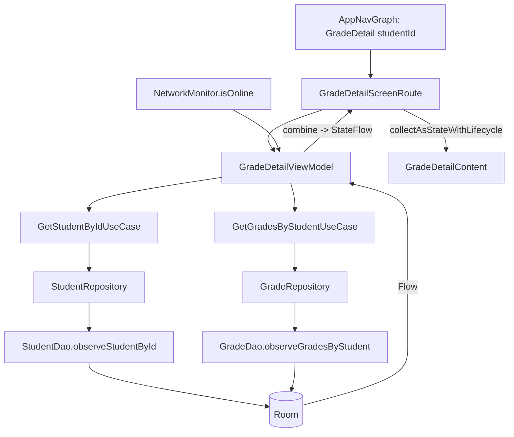

# 🔧 Correcciones de los puntos pendientes — AlegriApp

> Documento de cierre de los pendientes detectados en `ANALISIS_ESTUDIO_PROYECTO.md`.
> Estado: **compila correctamente** (`./gradlew :app:compileDebugKotlin` → `BUILD SUCCESSFUL`).
> No se eliminó funcionalidad existente y se respetó la arquitectura (Clean Architecture + MVVM + offline-first).

---

## Resumen de lo corregido

| # | Pendiente | Estado |
| --- | --- | --- |
| 1 | `GradeDetailScreen` usaba datos *mock* | ✅ Conectado a datos reales (Room, offline-first) |
| 2 | Edge-to-Edge incompleto | ✅ `enableEdgeToEdge()` agregado en `MainActivity` |
| 3 | DI manual con `AppModule` | ✅ Se mantiene manual, ordenado y consistente (justificación abajo) |
| 4 | `runBlocking` en el seeder | ✅ Refactorizado a `CoroutineScope` no bloqueante |
| 5 | Dependencias Retrofit duplicadas | ✅ Limpiadas en `app/build.gradle.kts` |

---

## 1. GradeDetailScreen — de mock a datos reales

### Qué estaba mal
La pantalla cargaba un estudiante **simulado** con un retardo artificial; no tocaba Room, ViewModel ni API:

```kotlin
// ANTES (GradeDetailScreen.kt)
LaunchedEffect(studentId) {
    uiState = GradeDetailUiState.Loading
    delay(500)                                  // retardo falso
    val mock = findMockDetailById(studentId)    // datos inventados
    uiState = if (mock == null) GradeDetailUiState.Empty
              else GradeDetailUiState.Success(student = mock, isFromCache = false)
}
```

### Qué se hizo
Se implementó el flujo real **offline-first** que ya usa el resto del proyecto: la pantalla observa Room por `Flow` a través de un `ViewModel`, casos de uso y repositorios. La base de datos **ya existía** (tablas `students` y `calificaciones`), así que solo se agregaron los accesos reactivos faltantes y la proyección al modelo de UI.

**Flujo nuevo:**



### Cómo quedó conectado `GradeDetailScreen`
1. **`GradeDetailScreenRoute(studentId, onBack)`** (nuevo) construye el `GradeDetailViewModel` con la DI manual (`AppModule`) y observa el estado con `collectAsStateWithLifecycle()`. Es el que usa la navegación real.
2. **`GradeDetailViewModel`** combina **3 flujos** (estudiante + calificaciones + conexión) y los proyecta a `GradeDetailUiState` (sealed class) cubriendo **Loading / Empty / Success / Error**:
   - Sin estudiante → `Error`.
   - Estudiante sin notas → `Empty`.
   - Con notas → `Success` (agrupa por materia, calcula promedios y estado aprobado/en riesgo con el mismo umbral que `GradesViewModel`: `< 10 → AT_RISK`).
   - Sin conexión → `Success(isFromCache = true)` → muestra el banner "datos locales".
3. El botón **"Sincronizar ahora"** y el reintento de los estados de error/empty ahora son **reales**: llaman a `viewModel.refresh()` → `SyncRepository.syncAll()` en `Dispatchers.IO`.
4. **`GradeDetailScreen(studentId, onBack, initialState)`** se conservó solo para los `@Preview` (renderiza un estado fijo, sin mock ni `delay`).
5. La navegación (`AppNavGraph.kt`) ahora invoca `GradeDetailScreenRoute` en lugar de `GradeDetailScreen`.

### Archivos creados
- `domain/usecase/grade/GetGradesByStudentUseCase.kt`
- `domain/usecase/student/GetStudentByIdUseCase.kt`
- `presentation/grades/GradeDetailViewModel.kt`

### Archivos modificados (módulo 1)
- `data/local/dao/StudentDao.kt` → nuevo `observeStudentById(studentId): Flow<StudentEntity?>`.
- `domain/repository/StudentRepository.kt` + `data/repository/StudentRepositoryImpl.kt` → `observeStudentById`.
- `domain/repository/GradeRepository.kt` + `data/repository/GradeRepositoryImpl.kt` → `observeGradesByStudent` (el `GradeDao` ya tenía la query `observeGradesByStudent`).
- `core/di/AppModule.kt` → providers `provideGetGradesByStudentUseCase` y `provideGetStudentByIdUseCase`.
- `presentation/grades/GradeDetailScreen.kt` → reescrito: `GradeDetailScreenRoute` + `GradeDetailContent` stateless; sin mock.
- `core/navigation/AppNavGraph.kt` → usa `GradeDetailScreenRoute`.

### Nota honesta sobre el esquema
El esquema de `calificaciones` **no guarda una fecha por nota** (solo timestamps de sincronización). Para no inventar datos ni tocar migraciones, la columna "fecha" de cada actividad en el detalle muestra el **tipo de evaluación** (`activityType`) como contexto. La columna "Última sincronización" se muestra como `—` por la misma razón. Ver *pendientes* al final.

---

## 2. Edge-to-Edge

### Qué estaba mal
`MainActivity` solo hacía `setContent { AlegriApp() }`; nunca activaba edge-to-edge (los insets se manejaban a medias solo por `Scaffold`).

### Qué se hizo
Se agregó `enableEdgeToEdge()` antes de `setContent` en `MainActivity.onCreate`:

```kotlin
override fun onCreate(savedInstanceState: Bundle?) {
    super.onCreate(savedInstanceState)
    enableEdgeToEdge()                 // ← nuevo
    SyncNotifications.ensureChannel(applicationContext)
    ...
}
```

No se rompe la visualización: todas las pantallas usan `Scaffold { innerPadding -> Modifier.padding(innerPadding) }`, que ya consume los insets de status/navigation bar, de modo que el contenido no queda tapado.

### Archivo modificado
- `MainActivity.kt` (import `androidx.activity.enableEdgeToEdge` + llamada).

---

## 3. Inyección de dependencias — decisión

### Decisión: **mantener la DI manual (`AppModule`)**, dejándola ordenada y consistente.

### Justificación
- **Alcance del proyecto:** es un proyecto académico ya funcional; migrar a Hilt implica agregar el plugin, KAPT/KSP de Hilt, anotar ~10 repositorios, ~20 casos de uso y reescribir todas las `viewModelFactory` de las pantallas. Es un cambio transversal de alto riesgo sin beneficio funcional inmediato.
- **Consistencia:** `AppModule` ya aplica el patrón **Singleton thread-safe** (doble verificación con `@Volatile` + `synchronized`) y centraliza el ensamblado. Los nuevos providers (`provideGetGradesByStudentUseCase`, `provideGetStudentByIdUseCase`) siguen exactamente ese estilo.
- **Sin romper nada:** el `GradeDetailViewModel` se inyecta con la misma técnica que `AttendanceViewModel`/`GradesViewModel` (`viewModelFactory { initializer { ... } }`), manteniendo coherencia total.

> Si en el futuro se quiere migrar a Hilt, el camino es directo porque las dependencias ya están descritas y agrupadas en un solo lugar.

---

## 4. Seeder — eliminar `runBlocking`

### Qué estaba mal
`AppModule.provideDatabase` **bloqueaba el hilo llamante** mientras sembraba la BD:

```kotlin
// ANTES
.also { database ->
    runBlocking(Dispatchers.IO) { DatabaseSeeder.seedIfEmpty(database) }  // ❌ bloquea
    db = database
}
```

### Qué se hizo
Se reemplazó por un **`CoroutineScope` de aplicación** con `SupervisorJob`, lanzando la siembra de forma asíncrona:

```kotlin
// AHORA
private val appScope = CoroutineScope(SupervisorJob() + Dispatchers.IO)
...
.also { database ->
    db = database
    appScope.launch { DatabaseSeeder.seedIfEmpty(database) }   // ✅ no bloquea
}
```

`DatabaseSeeder.seedIfEmpty` ya era `suspend` y solo inserta si las tablas están vacías. Como las pantallas leen vía `Flow`, se **refrescan solas** cuando la data demo termina de insertarse. No se bloquea ningún hilo (ni el principal ni el llamante).

### Archivo modificado
- `core/di/AppModule.kt` (nuevo `appScope`, imports `CoroutineScope`/`SupervisorJob`/`launch`, se quitó `runBlocking`).

---

## 5. `build.gradle.kts` — dependencias duplicadas

### Qué estaba mal
`retrofit.core` y `retrofit.gson` se declaraban **dos veces**:

```kotlin
// ANTES (líneas separadas)
implementation(libs.retrofit.core)   // 1ª vez
implementation(libs.retrofit.gson)
implementation(libs.okhttp.logging)
...
implementation(libs.retrofit.core)   // ❌ duplicado
implementation(libs.retrofit.gson)   // ❌ duplicado
implementation(libs.okhttp.core)
```

### Qué se hizo
Se consolidó el bloque de red en un solo lugar, sin duplicados y conservando todas las librerías realmente usadas:

```kotlin
// AHORA
implementation(libs.retrofit.core)
implementation(libs.retrofit.gson)
implementation(libs.okhttp.core)
implementation(libs.okhttp.logging)
```

### Archivo modificado
- `app/build.gradle.kts`

---

## Verificación

```
./gradlew :app:compileDebugKotlin  →  BUILD SUCCESSFUL
```

- KSP/Room validó el nuevo query `observeStudentById` sin errores.
- No quedaron referencias rotas (`findMockDetailById` quedó definido pero ya no se usa en producción; se conserva el archivo de mocks intacto para los `@Preview`).

---

## Lista completa de archivos tocados

**Creados (3)**
- `app/src/main/java/com/example/myapplication/domain/usecase/grade/GetGradesByStudentUseCase.kt`
- `app/src/main/java/com/example/myapplication/domain/usecase/student/GetStudentByIdUseCase.kt`
- `app/src/main/java/com/example/myapplication/presentation/grades/GradeDetailViewModel.kt`

**Modificados (9)**
- `app/src/main/java/com/example/myapplication/MainActivity.kt`
- `app/src/main/java/com/example/myapplication/core/di/AppModule.kt`
- `app/src/main/java/com/example/myapplication/core/navigation/AppNavGraph.kt`
- `app/src/main/java/com/example/myapplication/data/local/dao/StudentDao.kt`
- `app/src/main/java/com/example/myapplication/domain/repository/StudentRepository.kt`
- `app/src/main/java/com/example/myapplication/data/repository/StudentRepositoryImpl.kt`
- `app/src/main/java/com/example/myapplication/domain/repository/GradeRepository.kt`
- `app/src/main/java/com/example/myapplication/data/repository/GradeRepositoryImpl.kt`
- `app/src/main/java/com/example/myapplication/presentation/grades/GradeDetailScreen.kt`
- `app/build.gradle.kts`

---

## Pendientes / mejoras futuras (no bloqueantes)

1. **Fecha por calificación:** el esquema no tiene columna de fecha por nota. Para mostrar la fecha real haría falta una migración (`fecha`/`created_at` en `calificaciones`) y mapearla. Hoy se usa el tipo de evaluación como contexto.
2. **"Última sincronización" real:** exponer `serverUpdatedAt`/`lastSyncAttempt` desde `GradeEntity` hacia el dominio para mostrar la marca real en lugar de `—`.
3. **Exportar PDF:** sigue siendo un prototipo (snackbar). Queda como funcionalidad futura.
4. **Limpieza opcional:** `findMockDetailById` y `gradesMockStudents` ya no se usan en producción; podrían eliminarse cuando se quiten los `@Preview` que dependen de `gradeDetailMockStudent`.

---

# 🔟 Escala de calificaciones: de /20 a /10

> Segunda ronda de correcciones. Estado: **compila** (`./gradlew :app:compileDebugKotlin` → `BUILD SUCCESSFUL`).

## Dónde estaba definida la escala sobre 20
La escala `/20` estaba **quemada y dispersa** en varios puntos del módulo de notas:

| Lugar | Qué tenía |
| --- | --- |
| `GradeEditDraft.DEFAULT_MAX_SCORE` | `20.0` (nota máxima por defecto al editar) |
| `GradesEvent.EditGrade.maxScore` | `= 20.0` (default del evento de edición) |
| `GradesViewModel.refreshDerivedMetrics` | umbral de aprobación `score < 10.0` (50% de 20) y `maxScore` tomado del dato crudo |
| `GradeDetailViewModel` | `PASS_THRESHOLD = 10.0`, `DEFAULT_MAX_SCORE = 20` y mostraba `grade.maxScore` crudo |
| `GradeDetailHeaderCard` | texto **`/ 20`** quemado |
| `DatabaseSeeder` | notas demo con `maxScore = 20.0` y valores 16/18 |
| `GradeDetailMockData` / `GradesMockData` | `maxScore = 20` y notas 17–19 (datos de preview) |
| `TelegramMessageBuilder` | fallback `?: 20.0` en el boletín |

No existía una fuente única para la escala.

## Qué se cambió para trabajar sobre 10
1. **Constante central (única fuente de verdad):** se creó `core/common/Constants.kt` → objeto **`GradeScale`**:
   ```kotlin
   object GradeScale {
       const val MAX_SCORE: Double = 10.0     // escala oficial
       const val MAX_SCORE_INT: Int = 10      // para UI ("8 / 10")
       const val PASSING_GRADE: Double = 7.0  // nota mínima de aprobación (Ecuador: 7/10)
       fun normalize(score: Double, maxScore: Double) =
           if (maxScore > 0.0) score / maxScore * MAX_SCORE else score
   }
   ```
   > **Nota mínima de aprobación:** se fijó en **7.0** (estándar ecuatoriano sobre 10). Antes el código usaba `< 10` sobre 20 (un 50% genérico). Si la institución usa otro mínimo (p. ej. 5.0 para "mitad de escala"), se cambia **solo** esta constante.

2. **Normalización robusta:** tanto `GradeDetailViewModel` como `GradesViewModel` ahora **normalizan cada nota a /10** con `GradeScale.normalize(score, maxScore)` antes de promediar/mostrar. Esto garantiza `X / 10` **aunque** en Room/API quede algún registro viejo guardado sobre 20 (un `18/20` se muestra correctamente como `9.0/10`).

3. **Cálculo, promedio y estado sobre 10:**
   - Promedio por materia, promedio general y promedio de sección (tarjeta superior) se calculan sobre la nota normalizada → quedan sobre 10.
   - **Aprobado / En riesgo** usan `GradeScale.PASSING_GRADE` (≥ 7 aprobado, < 7 en riesgo) en ambos ViewModels.

4. **Defaults, seed y mocks a /10:** se actualizaron `GradeEditDraft`, `GradesEvent`, `DatabaseSeeder` (notas demo 8.0/9.0 sobre 10) y los datos de preview (`GradeDetailMockData`, `GradesMockData`) para que **ningún dato nuevo** nazca sobre 20.

5. **Texto visual:** `GradeDetailHeaderCard` ahora muestra `"/ ${GradeScale.MAX_SCORE_INT}"` (`/ 10`). Las tarjetas de materia y de estudiante ya usaban el `maxScore` del dato, que ahora es 10.

## Texto "Materia" → "Asignatura"
- El label estaba **hardcodeado** en `GradeFilterSection.kt` (`label = "Materia"`).
- Se movió a **string resources** (buena práctica) en `app/src/main/res/values/strings.xml`:
  `grade_filter_course`, `grade_filter_subject` (**"Asignatura"**), `grade_filter_evaluation_type`, `grade_filter_period`.
- `GradeFilterSection` ahora usa `stringResource(R.string.grade_filter_subject)`.

## ¿De dónde viene la calificación? (Room / API / mock)
- **Producción:** la nota se lee de **Room** (`GradeDao.observeGradesByStudent` / `observeGradesByCatalogFilters`) → repositorio → ViewModel. Room se alimenta de:
  - **API (Supabase):** `SyncRepositoryImpl` trae/sube `calificaciones` (`nota_obtenida`, `nota_maxima`).
  - **Seed local:** `DatabaseSeeder` (ahora sobre 10) para demo offline.
- **Mock:** solo lo usan los `@Preview` de Compose (`gradeDetailMockStudent`, `gradesMockStudents`), ya reescalados a /10. No se usan en la app real.
- Por la **normalización**, da igual la escala con que un registro haya quedado guardado: la UI siempre muestra y calcula sobre 10.

## Archivos modificados (escala)
- `app/src/main/java/com/example/myapplication/core/common/Constants.kt` *(constante `GradeScale` nueva)*
- `app/src/main/java/com/example/myapplication/presentation/grades/GradeEditDraft.kt`
- `app/src/main/java/com/example/myapplication/presentation/grades/GradesEvent.kt`
- `app/src/main/java/com/example/myapplication/presentation/grades/GradesViewModel.kt`
- `app/src/main/java/com/example/myapplication/presentation/grades/GradeDetailViewModel.kt`
- `app/src/main/java/com/example/myapplication/presentation/grades/components/GradeDetailHeaderCard.kt`
- `app/src/main/java/com/example/myapplication/presentation/grades/components/GradeFilterSection.kt`
- `app/src/main/java/com/example/myapplication/presentation/grades/components/GradeStudentCard.kt` *(valor de preview)*
- `app/src/main/java/com/example/myapplication/presentation/grades/components/GradesMockData.kt`
- `app/src/main/java/com/example/myapplication/presentation/grades/components/GradeDetailMockData.kt`
- `app/src/main/java/com/example/myapplication/data/local/DatabaseSeeder.kt`
- `app/src/main/java/com/example/myapplication/services/telegram/TelegramMessageBuilder.kt`
- `app/src/main/res/values/strings.xml` *(strings de filtros + "Asignatura")*

## Pendientes / notas sobre la escala
1. **Datos viejos en dispositivos ya instalados:** si un dispositivo tenía la BD sembrada antes de este cambio (notas demo sobre 20), esos registros siguen en Room con `maxScore = 20`. **La UI los muestra bien igual** gracias a la normalización, pero el valor crudo en la tabla seguirá siendo /20 hasta reinstalar o limpiar datos. No se hizo migración de Room porque la normalización resuelve la visualización y los cálculos sin riesgo.
2. **Validación al guardar (`Grade.init`)** sigue siendo genérica (`score in 0..maxScore`). Como los nuevos `maxScore` son 10, las notas nuevas se validan sobre 10 automáticamente.
3. **Label "Materia" en Asistencias:** el módulo de **Asistencias** (`AttendanceScreen` / `AttendanceViewModel`) todavía usa "Materia". Se dejó intacto porque el requerimiento era el filtro de **Calificaciones**; si se quiere unificar a "Asignatura" en toda la app, basta reusar `R.string.grade_filter_subject` ahí.
4. **Nota mínima de aprobación = 7.0:** es un valor de negocio configurable en `GradeScale.PASSING_GRADE`. Ajustar si la institución usa otro criterio.
